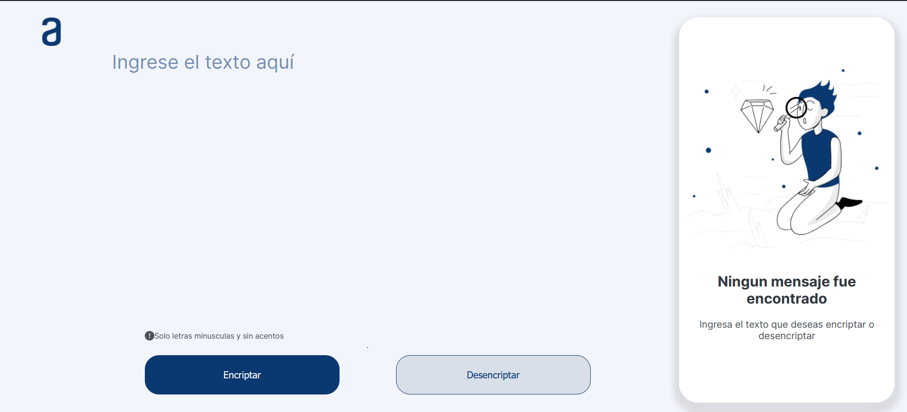

# Encriptador Challenge ONE

## Descripción

Encrypter es un programa diseñado para cifrar y descifrar un texto de manera interactiva. Utiliza algoritmos de encriptación sencillos para demostrar el manejo de habilidades.

## Características

- Cifrado y descifrado de textos.
- Interfaz intuitiva y fácil de usar.
- Responsive.

## Uso

1. Ingresa al siguiente link: 

## Uso

1. Abre el link
2. Ingresa el texto a encriptar
3. Puedes copiar el texto encriptado 
4. Desencriptar el texto que desees 

